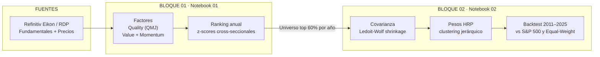

# Factor Investing + Hierarchical Risk Parity

### Un pipeline reproducible de selección de acciones (Quality · Value · Momentum) y construcción de carteras (HRP) sobre el S&P 500

> **TFM — Barcelona School of Management (UPF)**
> Replicación de tres papers de referencia (Asness *et al.* y López de Prado) integrados en una estrategia de inversión *end-to-end*, con backtest 2011–2025 sobre el S&P 500.

`Factor Investing` · `Quality Minus Junk` · `Value & Momentum` · `Hierarchical Risk Parity` · `Ledoit-Wolf` · `S&P 500` · `Backtesting` · `Python`

<!-- SUGERENCIA DE IMAGEN (hero): coloca aquí la curva de resultados del NB02.
      -->

---

## TL;DR — el proyecto en 30 segundos

Este repositorio construye una estrategia de inversión en **dos etapas** y mide **cuánto aporta cada una por separado**:

1. **Qué comprar** → un modelo multifactorial (Quality, Value, Momentum) rankea las acciones del S&P 500 cada año.
2. **Cuánto comprar** → *Hierarchical Risk Parity* (HRP) asigna los pesos de la cartera controlando el riesgo por estructura de correlaciones.

**Resultado principal:** una inversión de **100.000 € se convierte en ~753.000 €** con la mejor estrategia (Quality + HRP), frente a **~514.000 €** del S&P 500 en ~15 años. La conclusión de fondo: **el alpha viene de la selección de acciones, no de HRP**; HRP aporta una reducción de riesgo consistente pero modesta.

| | Mejor estrategia (Quality + HRP) | S&P 500 |
|---|:---:|:---:|
| CAGR | **14,7 %** | 11,8 % |
| Ratio de Sharpe | **0,77** | 0,59 |
| Max Drawdown | **−30,3 %** | −33,9 % |
| 100.000 € → | **~753.000 €** | ~514.000 € |

<sub>Período abr-2011 – dic-2025, neto de costes de 10 pb, tasa libre de riesgo 1,48 %.</sub>

---

## ¿Qué es y para qué sirve?

La inversión por factores ha mostrado de forma persistente que características como la **calidad**, el **valor** y el **momentum** explican parte sistemática del retorno de las acciones. Pero seleccionar buenas acciones no basta: **cómo se combinan en una cartera determina el riesgo real asumido**, y la optimización clásica de Markowitz es inestable y muy sensible a errores de estimación de la covarianza.

Este proyecto integra ambas decisiones en un proceso **reproducible y dinámico**: *qué* comprar (factores) y *cuánto* comprar (asignación por riesgo). La contribución metodológica es **separar el alpha (selección) de la gestión de riesgo (HRP) y medir la aportación de cada componente de forma aislada** — algo que la literatura de HRP raramente hace, ya que suele testearlo con activos genéricos (ETFs, índices) y no con un universo *stock-level* pre-filtrado por factores fundamentales.

---

## Arquitectura del proyecto



---

## Estructura del repositorio

> Estructura orientativa — ajústala a tu organización real de carpetas.

```
├── notebooks/
│   ├── 01_QMJ_analysis_V3.ipynb          # Bloque 01: selección de factores
│   └── 02_HRP_backtest_V3.ipynb          # Bloque 02: HRP + backtest
├── docs/
│   ├── TFM_Notebook01_v3_traspaso.md     # Metodología y resultados NB01
│   └── NB02_v3_Contexto_Redaccion.md     # Metodología y resultados NB02
├── data/
│   └── daily_prices_refinitiv_all.csv    # Precios diarios (590 RICs)
├── outputs/
│   ├── selected_universe_*.csv           # Universos seleccionados (NB01 → NB02)
│   ├── nb02_v3_nav_daily.csv             # NAV diario de todas las estrategias
│   ├── nb02_v3_weights_S1/S2/S3.csv      # Pesos históricos por rebalanceo
│   └── nb02_v3_performance.png           # Curva de resultados
├── assets/                               # Imágenes de este README
└── README.md
```

---

## Bloque 01 — Selección de factores *(Notebook 01)*

**Qué hace:** construye un modelo multifactorial que rankea, año a año, las acciones del S&P 500 según su calidad, valor y momentum, y valida estadísticamente su capacidad predictiva.

**Papers replicados:**
- Asness, Frazzini & Pedersen (2017), *Quality Minus Junk* → Quality = Profitability + Growth + Safety.
- Asness, Moskowitz & Pedersen (2013), *Value and Momentum Everywhere* → Value (book-to-market) y Momentum (12-2).

**Universo:** 502 empresas actuales del S&P 500 **+ 244 históricas** que estuvieron en el índice >5 años (**608 RICs válidos** tras filtros de calidad). Incluir las históricas **mitiga el survivorship bias**.

<!-- SUGERENCIA DE IMAGEN: el walkthrough de un caso (p. ej. META 2024), de ratios a ranking.
      -->

### Resultados clave

**Las correlaciones entre factores replican la literatura:**

| Par | Correlación | Interpretación |
|---|:---:|---|
| Quality – Value | **−0,52** | Las empresas de calidad cotizan "caras" (hallazgo central de QMJ) |
| Value – Momentum | **−0,28** | Trade-off clásico de *Value and Momentum Everywhere* |
| Quality – Momentum | **+0,19** | La calidad correlaciona con buen momentum |

**El hallazgo estadístico central — alpha ajustado por Fama-French 3 factores** (spread Q5–Q1, mensual, Newey-West):

| Estrategia | Alpha FF3 (anualizado) | t-stat |
|---|:---:|:---:|
| Quality | **+3,45 %** | **2,19** \*\* |
| Quality + Momentum | **+4,82 %** | **2,23** \*\* |
| QVM (con Value) | +1,33 % | 1,01 (n.s.) |

El modelo FF3 remueve el retorno explicado por mercado, tamaño y value, **y aun así queda alpha positivo y significativo** en Quality y Quality+Momentum — exactamente el argumento de QMJ. Añadir Value diluye la señal (el *value premium* fue nulo/negativo en el período, confirmado interna y externamente por el factor HML de Fama-French).

**Validaciones adicionales:**
- **Estabilidad del ranking** (Spearman año a año): Quality **0,875** (muy persistente → bajo turnover), Q+M 0,533, QVM 0,433.
- **Validación externa vs AQR** (fondo real de Asness): **78 %** de solapamiento de las posiciones *long* de AQR con el universo top 60 % de Quality+Momentum.

---

## Bloque 02 — Construcción de cartera con HRP *(Notebook 02)*

**Qué hace:** toma el universo seleccionado por el Bloque 01 y construye carteras asignando pesos con *Hierarchical Risk Parity*, luego las backtestea contra el S&P 500 y una cartera equiponderada (1/N).

**Paper replicado:**
- López de Prado (2016), *Building Diversified Portfolios that Outperform Out-of-Sample* → HRP: distancia de correlación → clustering jerárquico → quasi-diagonalización → bisección recursiva.
- Con shrinkage de covarianza de Ledoit & Wolf (2004) para estabilizar la matriz.

**Cómo funciona el backtest:** Top 50 acciones por score · ventana de covarianza de 504 días · reconstitución **anual** del universo (abril) + rebalanceo **trimestral** de pesos · costes de 10 pb sobre turnover · 59 rebalanceos con control estricto de *look-ahead bias* (reporting lag verificado ≥ 91 días).

<!-- SUGERENCIA DE IMAGEN: dendrograma HRP o heatmap de correlación quasi-diagonalizada.
      -->

### Resultados clave

**Métricas de las tres estrategias (HRP) frente al S&P 500** (abr-2011 – dic-2025):

| Estrategia | CAGR | Vol | **Sharpe** | Max DD | NAV (base 100) |
|---|:---:|:---:|:---:|:---:|:---:|
| **S1 · Quality — HRP** | 14,7 % | 17,1 % | **0,77** | −30,3 % | **753** |
| S2 · Quality+Momentum — HRP | 13,7 % | 18,6 % | 0,66 | −31,3 % | 659 |
| S3 · QVM — HRP | 12,3 % | 17,6 % | 0,61 | −37,7 % | 549 |
| *Benchmark* · S&P 500 | 11,8 % | 17,4 % | 0,59 | −33,9 % | 514 |

**¿Cuánto aporta HRP frente a equiponderar (1/N)?** HRP **reduce la volatilidad ~2,4–2,6 pp** y el drawdown en las tres variantes, pero esa reducción **no se traduce en una mejora significativa del Sharpe**: solo en Quality el Δ Sharpe es positivo (+0,03). En retorno absoluto, la equiponderada incluso supera a HRP.

**Significancia estadística** (test de Jobson-Korkie / Memmel vs S&P 500): solo **S1 Quality es marginalmente significativa** (p = 0,091); S2 y S3 no lo son. Detectar diferencias de Sharpe de 0,10–0,15 requeriría más años de datos.

---

## Hallazgos combinados

Las cuatro preguntas de investigación del proyecto y sus respuestas:

| | Pregunta | Respuesta |
|---|---|---|
| **P1** | ¿La señal de factores predice el retorno futuro? | **Sí** (IC ≈ 0,08, ICIR ≈ 0,45; alpha FF3 significativo en Quality y Q+M). |
| **P2** | ¿Qué combinación de factores funciona mejor? | **Quality y Quality+Momentum**; añadir Value empeora los resultados. |
| **P3** | ¿HRP mejora sobre la equiponderada (1/N)? | Reduce riesgo (vol y drawdown) de forma consistente pero **no bate a 1/N en Sharpe**. |
| **P4** | ¿La estrategia combinada bate al mercado? | **Sí en magnitud** (Sharpe 0,77 vs 0,59), aunque sin significancia estadística fuerte. |

**La narrativa en una frase:** el *factor investing* con Quality genera alpha económicamente relevante; HRP aporta una reducción de riesgo consistente pero modesta; y la combinación produce un mejor perfil riesgo-retorno que el benchmark. Elegir **qué** comprar importa más que decidir **cuánto**.

Un matiz interesante que une ambos bloques: en **predicción de retornos**, Quality+Momentum gana; pero en **construcción de carteras**, Quality *pura* tiende a ganar por su **estabilidad** (ranking Spearman 0,875), que reduce turnover y costes y produce covarianzas más fiables para HRP. No es contradictorio: son objetivos distintos.

---

## Datos

- **Fundamentales y precios:** Refinitiv Eikon / RDP. Fundamentales anuales 2005–2025; precios diarios de 590 RICs (2008–2025) y mensuales para la validación factorial.
- **Benchmarks y tasa libre de riesgo:** `^GSPC` (S&P 500) y `^IRX` (T-Bill 3 meses) vía `yfinance`.
- **Período efectivo del modelo:** 2010–2024 (Bloque 01); backtest abr-2011 – dic-2025 (Bloque 02).

> Los datos de Refinitiv son propietarios y **no se redistribuyen** en este repositorio.

---

## Rigor metodológico

Decisiones tomadas para que los resultados sean honestos y defendibles:

- **Mitigación del survivorship bias:** se incluyen 244 empresas que salieron del índice.
- **Control de look-ahead bias:** EVOL con ventana *rolling*, *publication lag* de 3 meses en fundamentales y máscara estricta de precios anteriores a cada rebalanceo (reporting lag ≥ 91 días verificado).
- **Corrección de errores estándar:** Newey-West para la autocorrelación por solapamiento de scores anuales.
- **Robustez:** los resultados son estables ante cambios de N (30/50/75), ventana (252/504 días), *linkage* (single/ward) y restricciones UCITS 5/10/40.

---

## Reproducir

```bash
# 1. Clonar el repositorio
git clone <url-del-repo>
cd <repo>

# 2. Instalar dependencias
pip install -r requirements.txt   # pandas, numpy, scipy, scikit-learn, matplotlib, yfinance, statsmodels

# 3. Ejecutar en orden:
#    notebooks/01_QMJ_analysis_V3.ipynb   → genera los universos seleccionados
#    notebooks/02_HRP_backtest_V3.ipynb   → consume esos universos y corre el backtest
```

> El acceso a Refinitiv requiere licencia; los precios ya descargados se guardan en `data/` para reproducir sin conexión en vivo.

---

## Referencias

- Asness, C., Frazzini, A., & Pedersen, L. H. (2017). *Quality Minus Junk*. Review of Accounting Studies.
- Asness, C., Moskowitz, T., & Pedersen, L. H. (2013). *Value and Momentum Everywhere*. The Journal of Finance.
- López de Prado, M. (2016). *Building Diversified Portfolios that Outperform Out-of-Sample*. The Journal of Portfolio Management.
- Ledoit, O., & Wolf, M. (2004). *A well-conditioned estimator for large-dimensional covariance matrices*. Journal of Multivariate Analysis.
- Jobson, J. D., & Korkie, B. (1981); Memmel, C. (2003). Tests de diferencia de ratios de Sharpe.

---

## Autoría y aviso

Trabajo Fin de Máster — Barcelona School of Management (UPF).
**Autor:** *[tu nombre]* · **Mentor:** *[nombre del mentor]*

> **Aviso:** este proyecto tiene fines exclusivamente académicos y de replicación. No constituye asesoramiento de inversión. Los resultados de backtest no garantizan rendimientos futuros.
